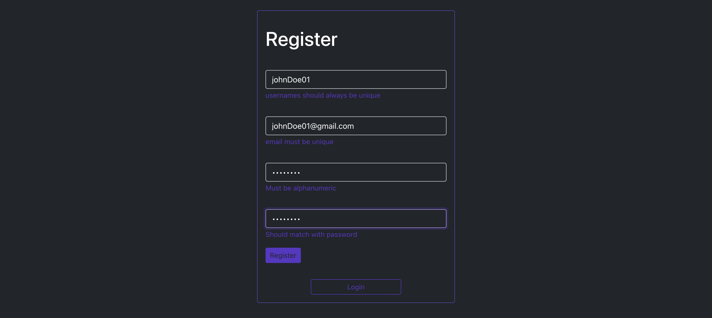
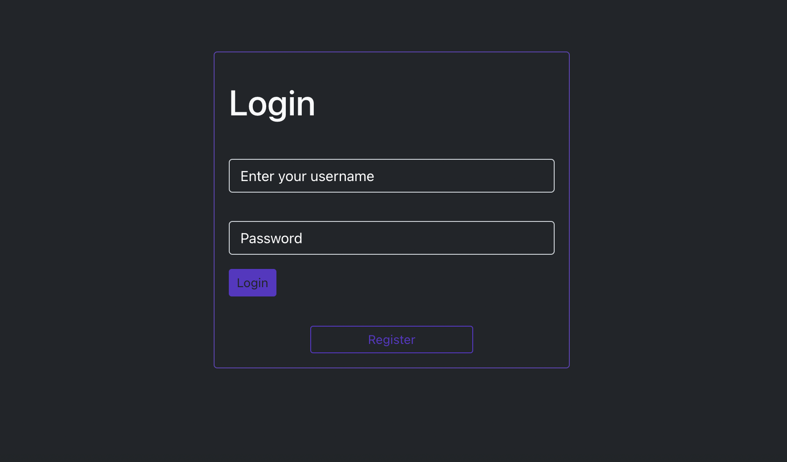
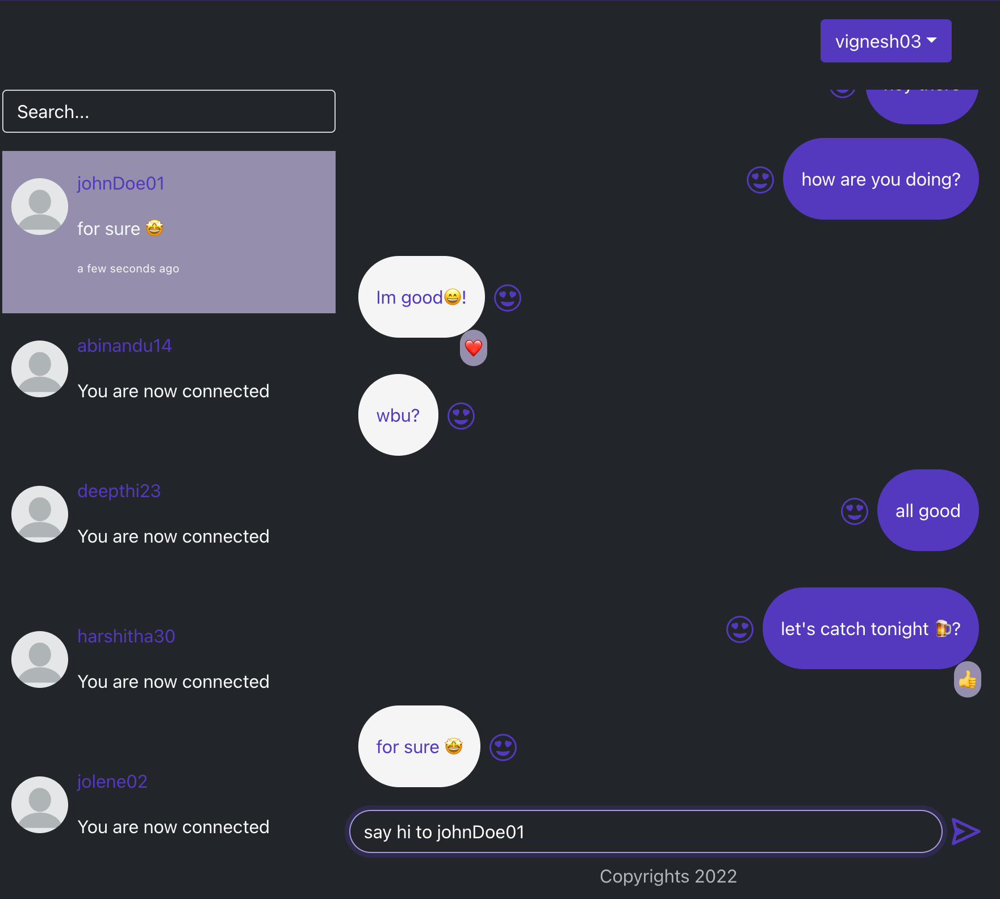

### chat-app

<div>
<a href="#overview">Overview</a> | <a href="#tech_stack">Tech stack</a> | <a href="#preview">
</div>

## OVERVIEW

<div id="overview"></div>
The #3 project in my GraphQL roadmap, A chat app built from scratch with React,Node,MongoDB and Graphql.
I built this project to get a clear understanding of how subscriptions work in Graphql.

## TECH STACK

<div id="tech_stack"></div>

```
react
react-bootstrap
apollo
graphql
MongoDB
jsonwebtoken
node

```

## PREVIEW

<div id="preview"></div>

# SIGNUP SCREEN



# LOGIN SCREEN



# CHAT SCREEN


